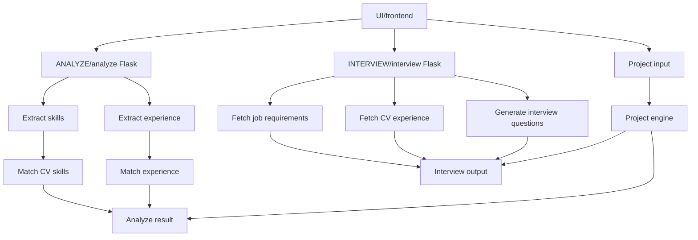

## JobbTren

**AI-drevet intervjutreningsverktøy**  
Bygget med **Java (Spring Boot)** + **Python (Flask)** + **spaCy + LLM (Groq / llama-3.3-70b-versatile)**

---

### Hva er JobbTren?
- Analysere CV-tekst (inkl. perioder og roller)
- Ekstrahere tekniske ferdigheter automatisk
- Beregne **utviklererfaring i år** basert på CV-perioder og stillinger
- Sammenligne ferdigheter med stillingskrav
- Få en **match-score** som kombinerer både skill-treff og erfaring opp mot kravene i stillingsannonsen
- Generere realistiske intervjusvar basert på ferdighetene dine

Alt med ett klikk — ideelt for deg som søker jobb og ønsker å forberede gode svar raskt.


### Arkitektur


### Erfaring & Match-score

JobbTren analyserer ikke bare nøkkelord, men forsøker også å tolke faktisk utviklererfaring fra CV-en:

- Finner tidsperioder (fra–til) i CV-en
- Knytter perioder til utviklerroller (f.eks. “utvikler”, “konsulent”, “software engineer”)
- Beregner antall år som utvikler
- Leser stillingsannonsen for å finne krav til antall års erfaring
- Justerer match-scoren basert på både skill-treff og erfaring (inkl. fleksibilitet i kravet hvis annonsen åpner for det)

Match-scoren er altså en kombinasjon av:
- hvor godt CV-skills matcher job-skills, og
- hvor godt din erfaring i år står i forhold til kravene i annonsen.

---


---
### Teknologi


- Java 17, Spring Boot
- Python 3.x, Flask
- spaCy (NLP)
- llama / Groq LLM-modell
- PDF-parsing (pdfplumber), HTML-parsing (BeautifulSoup)
- REST API, JSON
---
### Kjør prosjektet lokalt
- Installer avhengigheter:
```bash
pip install -r requirements.txt
 python -m spacy download en_core_web_lg
 ```

- Legg inn API-nøkkel (Groq) (i terminal):
```bash
setx GROQ_API_KEY "din_nokkel"
```

- Start server:
```bash
python app.py
```

- Frontend:
```bash
npm install
```
```bash
npm start
```
Kjører på http://localhost:3000

---
### Eksempel (workflow)

Last opp CV + stillings-URL

Få skills + match / gap + erfaring

Velg ferdigheter + prosjekter → generer svar

Bruk svarene i intervjuer eller som utgangspunkt for forbedringer

---

### Status & Veien Videre
- Status: Proof-of-Concept / MVP
- Videre plan:
    -  Mer robust matching (fuzzy / vektet)
    - Mulighet for «styrkeloop» / feedback-runde for intervjusvar
    - UI-frontend (minimalistisk)
    - Docker / deployment-setup

---

### Formål
JobbTren er utviklet for å gi en praktisk og effektiv måte å forberede seg til tekniske intervjuer. Løsningen analyserer både CV og stillingsannonse, identifiserer relevante ferdigheter og mangler, og genererer skreddersydde intervjuspørsmål og eksempelsvar basert på faktiske prosjekter brukeren har jobbet med. Målet er å gi en realistisk treningsopplevelse som speiler hvordan man faktisk kommuniserer i et intervju – uten overdrivelser, fantasi-prosjekter eller generiske AI-svar. Appen er laget for å være lokal, rask og enkel å bruke, og fungerer som et verktøy for å styrke presentasjonsevne, selvtillit og struktur i intervjusituasjoner.

---

Danial Alvi

---

